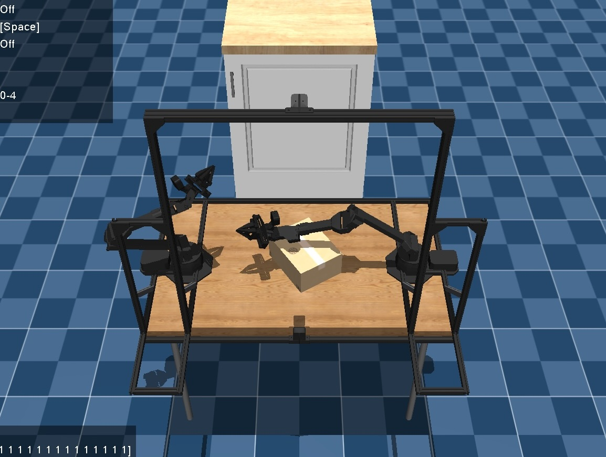
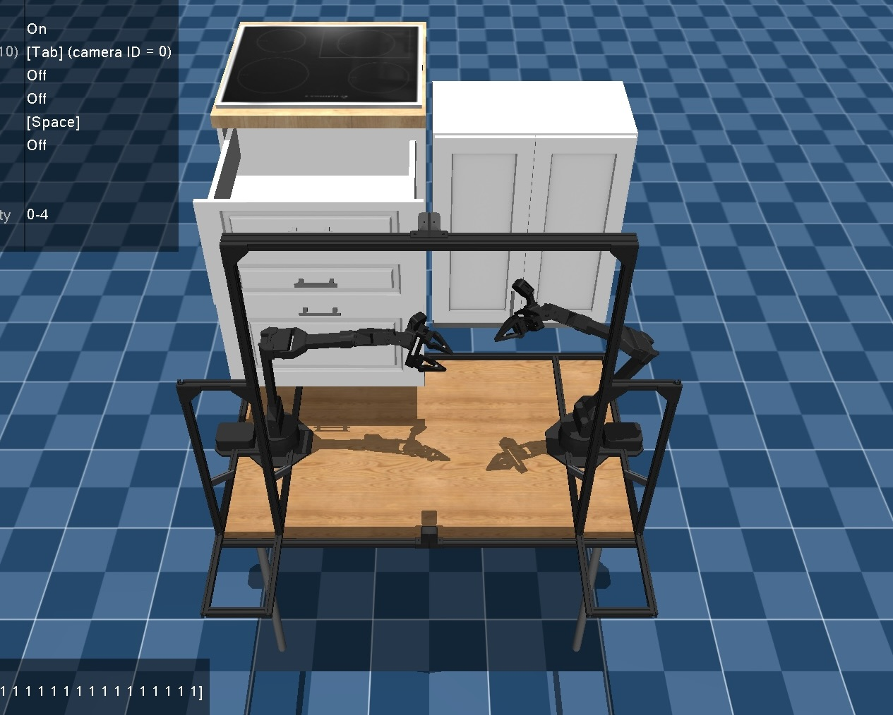
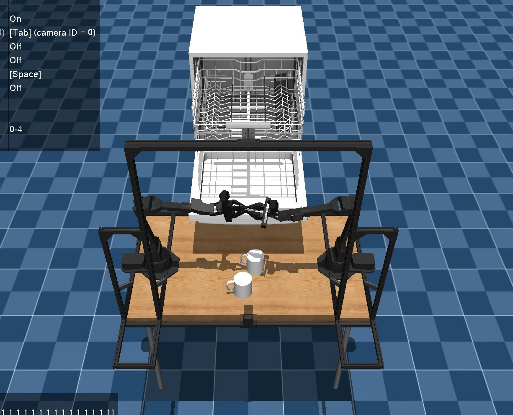
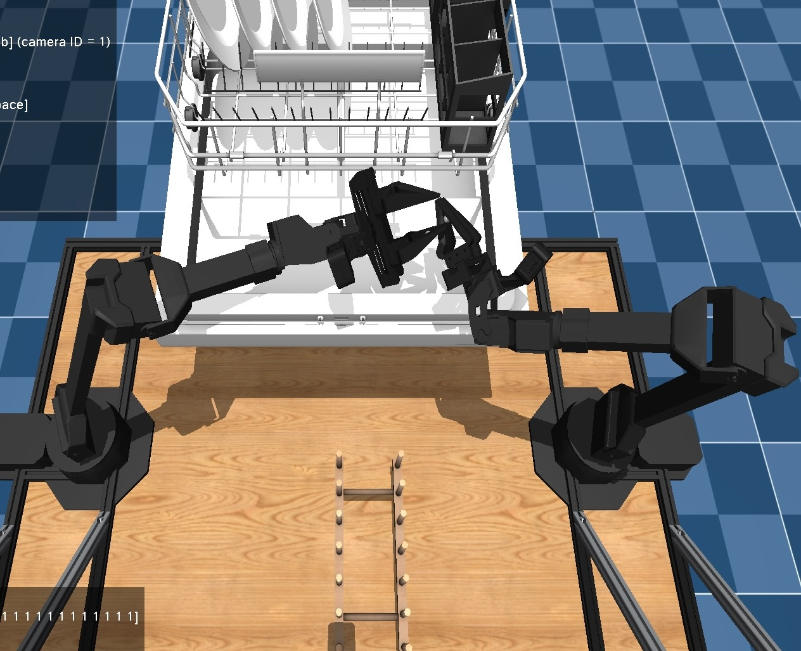
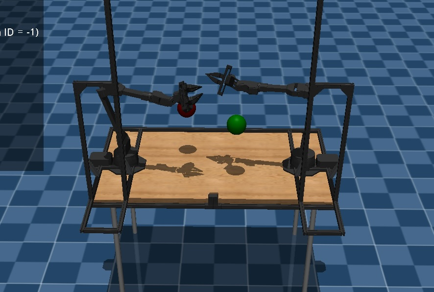
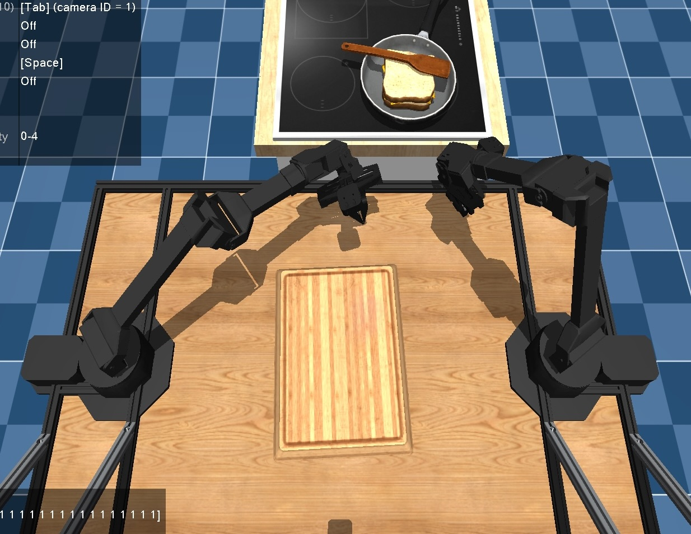

## Filemap

[aloha_box.py](aloha_box.py) contains `StoreBox` and `PickBox`
<div>
  
</div>

[aloha_cupboards.py](aloha_cupboards.py) contains `WallCupboardOpen`, `WallCupboardClose`, `DrawerTopOpen`, `DrawerTopClose`, `DrawersAllOpen`, `DrawersAllClose`
<div>
  
</div>

[aloha_dishwasher.py](aloha_dishwasher.py) contains `DishwasherOpen`, `DishwasherClose`, `DishwasherOpenTrays`, `DishwasherCloseTrays`

[aloha_dishwasher_cups.py](aloha_dishwasher_cups.py) contains `DishwasherUnloadCups`, `DishwasherLoadCups`, `DishwasherUnloadCupsLong`
<div>
  
</div>

[aloha_dishwasherplates.py](aloha_dishwasherplates.py) contains `DishwasherUnloadPlates`, `DishwasherLoadPlates`, `DishwasherUnloadPlatesLong`
<div>
  
</div>

[aloha_dishwashercutlery.py](aloha_dishwashercutlery.py) contains `DishwasherUnloadCutlery`, `DishwasherLoadCutlery`, `DishwasherUnloadCutleryLong`

[aloha_dualreachtar.py](aloha_dualreachtar.py) contains `ReachTargetDual`, `ReachTarget`, `ReachTargetSingle`
<div>
  
</div>

[aloha_flip.py](aloha_flip.py) contains `FlipCup`, `FlipCutlery`

[aloha_groceries.py](aloha_groceries.py) contains `GroceriesStore`
<div>
  
</div>

[aloha_moveplates.py](aloha_moveplates.py) contains `MovePlate`, `MoveTwoPlates`

[aloha_saucepan.py](aloha_saucepan.py) contains `FlipSandwich`, `ToastSandwich`, `SaucepanToHob`, `RemoveSandwich`
<div>
  
</div>

[aloha_stackblocks.py](aloha_stackblocks.py) contains `StackBlocks` 
<div>
  
</div>

[aloha_storekitchenware.py](aloha_storekitchenware.py) contains `StoreKitchenware`

[aloha_takecups.py](aloha_takecups.py) contains `TakeCups`, `PutCups`

<div>
  
</div>

No longer relevant: `PickBox`, `GroceriesStoreLower`, `CupboardsOpenAll`, `CupboardsCloseAll`


# Common Errors

If this error is encountered: 

```
from mojo.elements import Body, Site, MujocoElement
ImportError: cannot import name 'MujocoElement' from 'mojo.elements'
```

Add this line to `site-packages/mojo/elements/__init__.py` in your python directory:

`from mojo.elements.element import MujocoElement`